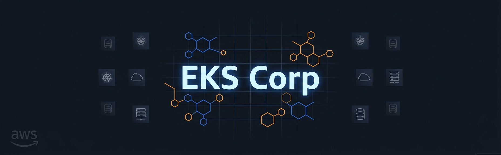
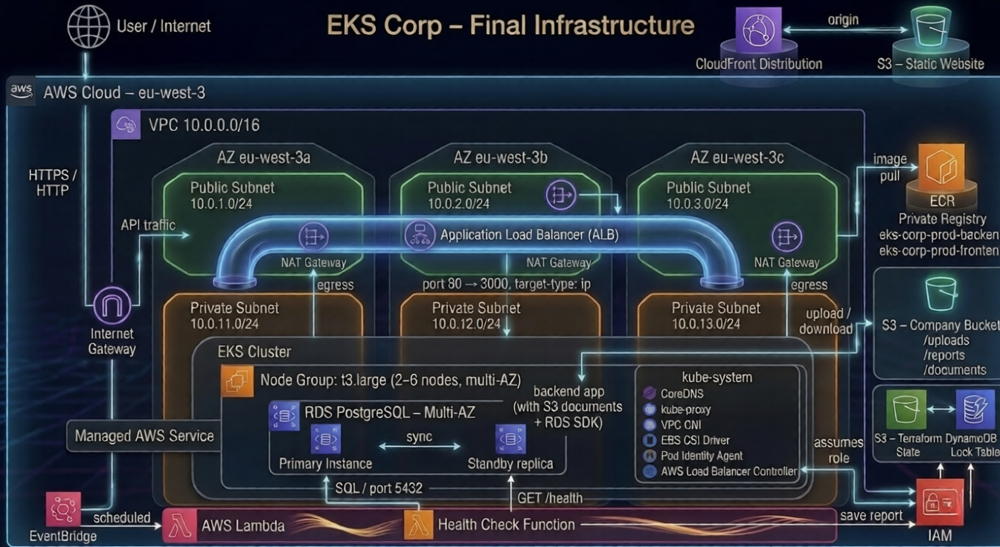
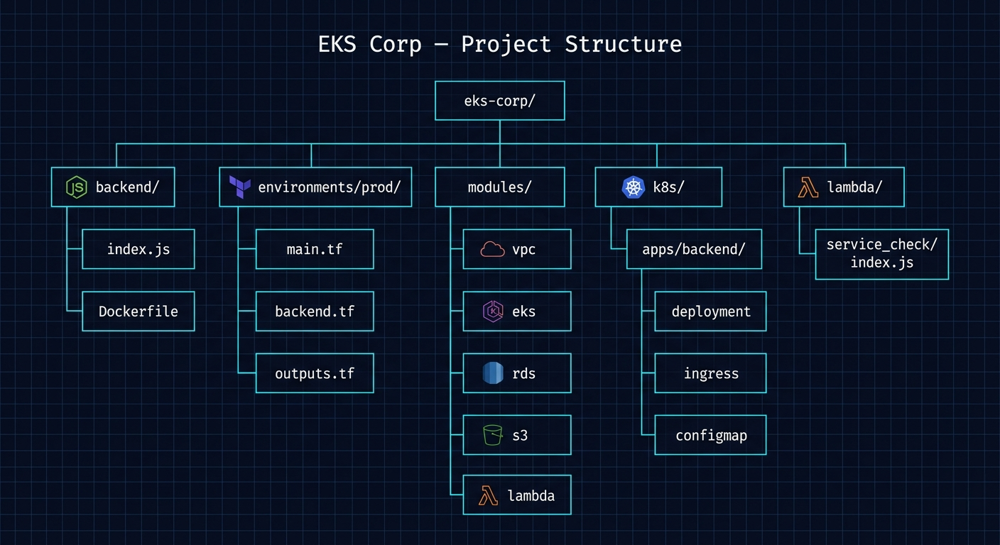

<a id="readme-top"></a>

<div align="center">
  
  <br /><br />

  <a href="https://github.com/KovyD20/eks-corp"><strong>Explore the repo »</strong></a>
  &nbsp;&nbsp;·&nbsp;&nbsp;
  <a href="https://github.com/KovyD20/eks-corp/issues/new?labels=bug">Report Bug</a>
  &nbsp;&nbsp;·&nbsp;&nbsp;
  <a href="https://github.com/KovyD20/eks-corp/issues/new?labels=enhancement">Request Feature</a>
</div>

---

<!-- TABLE OF CONTENTS -->
<details>
  <summary>Table of Contents</summary>
  <ol>
    <li><a href="#about-the-project">About The Project</a></li>
    <li><a href="#architecture">Architecture</a></li>
    <li><a href="#built-with">Built With</a></li>
    <li><a href="#getting-started">Getting Started</a></li>
    <li><a href="#deployment">Deployment</a></li>
    <li><a href="#usage">Usage</a></li>
    <li><a href="#project-structure">Project Structure</a></li>
    <li><a href="#roadmap">Roadmap</a></li>
    <li><a href="#contact">Contact</a></li>
  </ol>
</details>

---

## About The Project

EKS Corp is a production-grade AWS infrastructure project that simulates a real company cloud environment. It provisions and manages a complete cloud stack using Terraform as Infrastructure as Code, covering networking, container orchestration, managed databases, object storage, and serverless automation.

**Key highlights:**
- Multi-AZ, highly available EKS cluster running a containerised Node.js backend
- Private ECR for container image storage
- RDS PostgreSQL with Multi-AZ failover, credentials managed via AWS Secrets Manager
- Company S3 bucket with folder-level IAM policies for uploads, documents, and reports
- Serverless Lambda automation that runs hourly health checks and saves reports to S3
- Remote Terraform state stored in S3 with DynamoDB locking
- All AWS permissions handled through Pod Identity — no static credentials

<p align="right">(<a href="#readme-top">back to top</a>)</p>

---

## Architecture

<div align="center">
  
</div>
<br />

The infrastructure runs in `eu-west-3` (Paris) across 3 Availability Zones:

| Layer | Technology | Details |
|---|---|---|
| Networking | AWS VPC | 3 public + 3 private subnets, NAT Gateways per AZ |
| Container Orchestration | Amazon EKS 1.33 | t3.large nodes, 2–6 auto-scaling, multi-AZ |
| Container Registry | Amazon ECR | Private, immutable tags, scan on push |
| Database | Amazon RDS PostgreSQL | Multi-AZ, db.t3.medium, Secrets Manager credentials |
| Object Storage | Amazon S3 | Company bucket (uploads/documents/reports) + Terraform state bucket |
| Automation | AWS Lambda + EventBridge | Hourly service check, saves JSON report to S3 |
| Load Balancing | AWS ALB | Managed by AWS Load Balancer Controller via Helm |
| IAM | Pod Identity | No static credentials — roles assumed per service account |
| State Management | S3 + DynamoDB | Remote Terraform backend with state locking |

<p align="right">(<a href="#readme-top">back to top</a>)</p>

---

## Built With

[![Terraform][Terraform-badge]][Terraform-url]
[![AWS][AWS-badge]][AWS-url]
[![Kubernetes][K8s-badge]][K8s-url]
[![Node.js][Node-badge]][Node-url]
[![Docker][Docker-badge]][Docker-url]
[![PostgreSQL][Postgres-badge]][Postgres-url]

<p align="right">(<a href="#readme-top">back to top</a>)</p>

---

## Getting Started

### Prerequisites

The following tools must be installed and configured before deploying:

- **AWS CLI** – configured with appropriate permissions
  ```sh
  aws configure
  ```
- **Terraform** >= 1.6.0
  ```sh
  terraform -version
  ```
- **kubectl**
  ```sh
  kubectl version --client
  ```
- **Helm** >= 3.0
  ```sh
  helm version
  ```
- **Docker** – for building and pushing backend images
  ```sh
  docker --version
  ```

### Bootstrap (one-time setup)

Before the first `terraform apply`, the remote state backend must be created manually via AWS CLI:

```sh
# Create S3 bucket for Terraform state
aws s3api create-bucket \
  --bucket eks-corp-terraform-state \
  --region eu-west-3 \
  --create-bucket-configuration LocationConstraint=eu-west-3

aws s3api put-bucket-versioning \
  --bucket eks-corp-terraform-state \
  --versioning-configuration Status=Enabled

aws s3api put-bucket-encryption \
  --bucket eks-corp-terraform-state \
  --server-side-encryption-configuration '{"Rules":[{"ApplyServerSideEncryptionByDefault":{"SSEAlgorithm":"AES256"}}]}'

# Create DynamoDB table for state locking
aws dynamodb create-table \
  --table-name eks-corp-terraform-locks \
  --attribute-definitions AttributeName=LockID,AttributeType=S \
  --key-schema AttributeName=LockID,KeyType=HASH \
  --billing-mode PAY_PER_REQUEST \
  --region eu-west-3
```

<p align="right">(<a href="#readme-top">back to top</a>)</p>

---

## Deployment

### 1. Clone the repository

```sh
git clone https://github.com/KovyD20/eks-corp.git
cd eks-corp
```

### 2. Deploy infrastructure

```sh
cd environments/prod
terraform init
terraform apply
```

### 3. Configure kubectl

```sh
aws eks update-kubeconfig \
  --name eks-corp-prod \
  --region eu-west-3
```

### 4. Install AWS Load Balancer Controller

```sh
helm repo add eks https://aws.github.io/eks-charts
helm repo update

helm install aws-load-balancer-controller eks/aws-load-balancer-controller \
  -n kube-system \
  --set clusterName=eks-corp-prod \
  --set serviceAccount.create=true \
  --set serviceAccount.name=aws-load-balancer-controller
```

### 5. Build and push backend image

```sh
cd backend
aws ecr get-login-password --region eu-west-3 | \
  docker login --username AWS --password-stdin \
  554422868760.dkr.ecr.eu-west-3.amazonaws.com

docker build -t eks-corp-prod-backend:v1.0.0 .
docker tag eks-corp-prod-backend:v1.0.0 \
  554422868760.dkr.ecr.eu-west-3.amazonaws.com/eks-corp-prod-backend:v1.0.0
docker push \
  554422868760.dkr.ecr.eu-west-3.amazonaws.com/eks-corp-prod-backend:v1.0.0
```

### 6. Update ConfigMap and deploy to Kubernetes

```sh
# Get outputs from Terraform
terraform output rds_secret_arn
terraform output s3_bucket_name

# Update k8s/apps/backend/configmap.yaml with the values above, then:
kubectl apply -f k8s/apps/backend/namespace.yaml
kubectl apply -f k8s/apps/backend/serviceaccount.yaml
kubectl apply -f k8s/apps/backend/configmap.yaml
kubectl apply -f k8s/apps/backend/deployment.yaml
kubectl apply -f k8s/apps/backend/service.yaml
kubectl apply -f k8s/apps/backend/ingress.yaml
```

### 7. Verify deployment

```sh
kubectl get pods -n backend
kubectl get ingress -n backend
```

The ALB address from the ingress output is the public endpoint of the application.

<p align="right">(<a href="#readme-top">back to top</a>)</p>

---

## Usage

### API Endpoints

| Method | Endpoint | Description |
|---|---|---|
| GET | `/` | API info and version |
| GET | `/health` | Health check — verifies DB connectivity |
| POST | `/api/files/upload` | Upload a file to S3 (`uploads/` prefix) |
| GET | `/api/files/download?key=uploads/file.pdf` | Download a file from S3 via the backend |
| GET | `/api/files/list?prefix=uploads/` | List files under an S3 prefix |

### Example requests

```sh
# Health check
curl http://<ALB_URL>/health

# Upload a file
curl -F "file=@./document.pdf" http://<ALB_URL>/api/files/upload

# List uploaded files
curl http://<ALB_URL>/api/files/list?prefix=uploads/
```

### Lambda service check

The Lambda function runs automatically every hour via EventBridge. To trigger it manually:

```sh
aws lambda invoke \
  --function-name eks-corp-prod-service-check \
  --region eu-west-3 \
  output.json && cat output.json
```

Reports are saved to `s3://eks-corp-prod-company-<account_id>/reports/`.

<p align="right">(<a href="#readme-top">back to top</a>)</p>

---

## Project Structure

<div align="center">
  
</div>

<p align="right">(<a href="#readme-top">back to top</a>)</p>

---

## Roadmap

- [x] VPC with multi-AZ networking
- [x] EKS cluster with auto-scaling node group
- [x] Private ECR repositories
- [x] AWS Load Balancer Controller with Pod Identity
- [x] RDS PostgreSQL Multi-AZ with Secrets Manager
- [x] Company S3 bucket with folder-level IAM policies
- [x] S3 file upload/download via backend API
- [x] Remote Terraform state (S3 + DynamoDB)
- [x] Lambda service check automation with EventBridge
- [ ] CloudFront + S3 static website
- [ ] HR management backend application with authentication
- [ ] Automated test suite

<p align="right">(<a href="#readme-top">back to top</a>)</p>

---

## Contact

Kövy Dániel - (Daniel Koevy) 

GitHub: https://github.com/KovyD20

LinkedIn: <https://www.linkedin.com/in/d%C3%A1niel-k%C3%B6vy-62129b324/>

E-mail: kovy.d20@gmail.com

Project Link: [https://github.com/KovyD20/eks-corp](https://github.com/KovyD20/eks-corp)


<p align="right">(<a href="#readme-top">back to top</a>)</p>

---

<!-- MARKDOWN LINKS & IMAGES -->
[contributors-shield]: https://img.shields.io/github/contributors/KovyD20/eks-corp.svg?style=for-the-badge
[contributors-url]: https://github.com/KovyD20/eks-corp/graphs/contributors
[forks-shield]: https://img.shields.io/github/forks/KovyD20/eks-corp.svg?style=for-the-badge
[forks-url]: https://github.com/KovyD20/eks-corp/network/members
[stars-shield]: https://img.shields.io/github/stars/KovyD20/eks-corp.svg?style=for-the-badge
[stars-url]: https://github.com/KovyD20/eks-corp/stargazers
[issues-shield]: https://img.shields.io/github/issues/KovyD20/eks-corp.svg?style=for-the-badge
[issues-url]: https://github.com/KovyD20/eks-corp/issues
[linkedin-shield]: https://img.shields.io/badge/-LinkedIn-black.svg?style=for-the-badge&logo=linkedin&colorB=555
[linkedin-url]: https://linkedin.com/in/linkedin_username

[Terraform-badge]: https://img.shields.io/badge/Terraform-7B42BC?style=for-the-badge&logo=terraform&logoColor=white
[Terraform-url]: https://www.terraform.io/
[AWS-badge]: https://img.shields.io/badge/AWS-232F3E?style=for-the-badge&logo=amazonwebservices&logoColor=white
[AWS-url]: https://aws.amazon.com/
[K8s-badge]: https://img.shields.io/badge/Kubernetes-326CE5?style=for-the-badge&logo=kubernetes&logoColor=white
[K8s-url]: https://kubernetes.io/
[Node-badge]: https://img.shields.io/badge/Node.js-339933?style=for-the-badge&logo=nodedotjs&logoColor=white
[Node-url]: https://nodejs.org/
[Docker-badge]: https://img.shields.io/badge/Docker-2496ED?style=for-the-badge&logo=docker&logoColor=white
[Docker-url]: https://www.docker.com/
[Postgres-badge]: https://img.shields.io/badge/PostgreSQL-4169E1?style=for-the-badge&logo=postgresql&logoColor=white
[Postgres-url]: https://www.postgresql.org/
